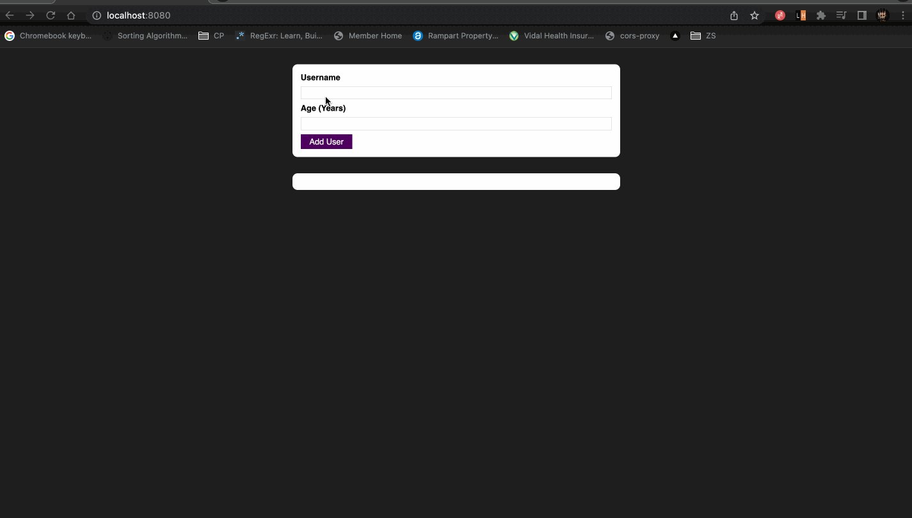

## User List Renderer

Visit [here](/src) to view the source code

### Hands On!

You can try hands-on on the project [here](https://basic-user-list-renderer-react.herokuapp.com/)

### Working Video

### Features

- Add users with their name and age
- List all the users
- Perform validation checks where username and age cannot be negative
- Perform validation checks where age cannot be less than 1
- Show error modal on the event of an error

### Scope for Improvement

- The state of a user list renderer is not stored in the local storage, which can be implemented
